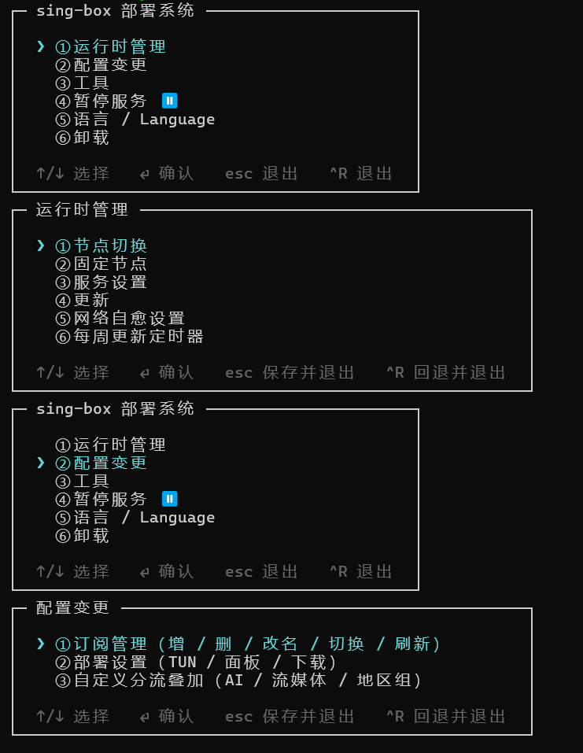

# sboxkit

在 Linux 上交互式部署 / 管理 **sing-box** 的终端应用。单个静态二进制，
全流程交互完成：**初始化 / 更改配置 / 暂停启动 / 网络测试 / 卸载**。
> 如果想体验mihomo内核，可以参考[clashdock](https://github.com/Trilives/clashdock)
- **机场订阅三选一**：Clash 订阅（经 `internal/converter` 转换为 sing-box 配置，
  含 AI / 流媒体 / 地区自动测速分组现场生成）、sing-box 原生订阅（可选择直接信任
  或按同一套规则重建）、通用 base64 节点链接（经 subconverter 或本地解析）。
- **开箱即用**：.deb 包内置 sing-box 内核与基础 geo 规则集（`geosite-cn.srs` +
  `geoip-cn.srs`），安装后**离线即可启动**；可稍后在线更新到最新版本。
- **单文件零依赖**：Go 编译的静态二进制，不需要 python3 / curl / 任何运行时；
  内置 Web 面板资源直接 go:embed 进二进制，也不需要联网下载。
- **自更新**：主菜单一键把 sboxkit 自身更新到最新发行版（校验 SHA-256、原子
  切换版本、失败自动回滚），无需重新走一遍 .deb 安装；稳定版 / 预览版双渠道可选，
  切到预览版后可一键回退到上一个稳定版。
- **TUI 交互**：方向键导航、反显高亮、长提示语自动换行；非 TTY（管道/脚本）
  自动回退编号菜单。
- **随时可中止可回退**：配置类改动包在事务里，**esc 保存退出、^R 回退退出**，
  已应用的改动自动回滚。
- **按需提权**：普通用户启动，需要 root 时自动 `sudo`。

## 安装

### 方式一：.deb（推荐，内置离线种子）

从 [Releases](https://github.com/Trilives/sboxkit/releases) 下载对应架构的包：

```bash
sudo dpkg -i sboxkit_*_linux_amd64.deb   # 或 arm64 / armv7
sboxkit
```

.deb 内含：`/usr/bin/sboxkit`、sing-box 内核（`/usr/libexec/sboxkit/sing-box`）、
基础 geo 规则集种子（`/usr/share/sboxkit/ruleset/`）。首次初始化会自动接管这些种子，
无需联网即可注册并启动服务。第三方资产的许可与归属见
`/usr/share/doc/sboxkit/copyright`。

### 方式二：tar.gz（仅二进制）

```bash
tar -xzf sboxkit_*_linux_amd64.tar.gz
./sboxkit    # 内核 / geo 规则集由程序内『下载』步骤在线获取
```

### 方式三：源码构建

```bash
git clone https://github.com/Trilives/sboxkit.git && cd sboxkit
make build && ./sboxkit
```

## 使用

**推荐方式：直接运行 `sboxkit` 进入交互式终端**——这正是本项目的特点：
部署、订阅、切节点、服务管理全部在方向键菜单里完成，esc 保存返回、^R 回退返回，
无需记忆任何命令。

```bash
sboxkit
```

脚本化 / 无人值守场景另有一组子命令（`init` / `modify` / `nettest` /
`pause` / `resume` / `update` / `uninstall` 等），详见
[docs/COMMANDS.md](docs/COMMANDS.md)。

## 预览

首次运行（或检测到服务尚未注册）会先询问界面语言，再询问是否现在进行初始化；
主菜单默认英文启动，可在「Language / 语言」里切成中文（部分终端无法正常显示中文字符）。



「配置变更」子菜单包含订阅管理（增/删/改名/切换/刷新，且切换/刷新会自动同步并重启服务）、
部署设置（TUN / 面板 / 下载）与分流增强（AI / 流媒体 / 地区自动测速组）——两个定制层字段
分组直接是本菜单下的平级项，不再经过多余的中间层；「运行时管理」里的操作均为即时生效的
系统操作，各自按需处理重启（无需你事后再单独重启一次）。「工具」聚合网络测试、主要文件
位置查看与信息（代理端口/局域网可达性/TUN/面板地址一览），未来会继续加。菜单选项按常用
程度排列（日常操作在前，卸载这类低频/破坏性操作放最后）。

方向键上下移动、⏎ 确认、esc 保存返回、^R 回退返回；每层菜单重入时光标停在上次选中项；
长提示语按终端宽度自动换行。非 TTY（管道/重定向）下自动回退为编号列表 + 文本输入。

## 功能一览

| 功能 | 说明 |
|---|---|
| 订阅管理 | 多订阅增/删/改名/切换/刷新；添加订阅支持 clash / sing-box 原生 / base64（经 subconverter 或本地解析）/ 本地文件四种来源；另有「本地文件覆盖」直接改写当前生效配置（不建订阅条目） |
| 定制层 | 拆成「部署设置」与「分流增强」两个分组：TUN / 局域网代理 / 面板对外监听 / 下载代理（主要用于订阅按需拉取）/ GitHub 镜像与 Token / 默认出站（节点切换目标分组）等 |
| 节点切换 | 运行时管理提供「节点切换」与「固定节点」两个独立操作：前者仅 Clash API 热切换不写盘，后者写入配置并可选重启；均支持两级菜单（地区→节点）+ 并发实测延迟 |
| 地区自动测速组 | 可选生成 SG-Auto / HK-Auto url-test 组，由 converter 现场生成并插入主选择组直接选用 |
| AI / 流媒体分流 | AI / 流媒体域名后缀分流组由 converter 每次现场生成（不再是可选叠加层） |
| sboxkit 自更新 | 稳定版 / 预览版双渠道；下载发行版、校验 SHA-256、原子切换版本、试跑校验，失败自动回滚；切到预览版后可一键回退到上一个稳定版 |
| systemd 集成 | 主服务 + 网络自愈 watchdog + 每周更新定时器，统一暂停/启动；Web 控制台走 sing-box 内置的 `:9090/ui/` 路径，支持分组三列视图、折叠、按组测速与节点热切换 |
| 网络自愈 | NetworkManager 钩子 + watchdog：断网/漫游后自动恢复，防重启风暴 |
| 工具 | 网络测试（流媒体/站点/AI 延迟 + OpenAI/Claude 出口 IP 落地）、主要文件位置一览、信息（代理端口/局域网可达性/TUN 模式/面板地址与密钥状态），聚合在同一个子菜单 |
| 日志 | 可选写入 `<state>/sboxkit.log`，超过体量上限自动裁剪保留最新内容 |
| 中英双语 | 默认英文启动（部分终端无法正常显示中文），检测到服务未注册时会先触发一次语言选择，主菜单「Language / 语言」随时可再切换，持久化到 `customize.json`；`SBOXKIT_LANG=en\|zh` 可覆盖 |

## 数据目录

运行期所有数据使用**固定工作目录 `/var/lib/sboxkit`**（不随用户 / HOME 变化，
root 运行的定时器与用户会话看到同一份数据；首次使用自动经 sudo 创建并交回属主）。
环境变量 `SBOXKIT_HOME` 可覆盖（主要用于测试）。运行时自包含暂存于
`/var/lib/sboxkit-runtime`，systemd 单元名为 `sing-box.service` /
`sing-box-watchdog.timer` / `sing-box-update.timer`。

## 目录结构

```
sboxkit/
├── cmd/sboxkit/          # 入口：子命令分发 + TUI 主菜单
├── internal/
│   ├── tui/                # Bubble Tea 交互组件（select/multiselect/ask/confirm）
│   ├── flows/              # 初始化 / 配置变更 / 运行时管理 / 网络测试 / 卸载 / 节点切换 等流程
│   ├── i18n/               # 中英文界面文案（默认英文，源码中文原文即翻译表 key）
│   ├── converter/          # Clash / sing-box 原生 / base64 → sing-box 配置的核心转换器
│   ├── subscription/       # 订阅：拉取 / 识别（三态）/ 分享链接解析 / manager
│   ├── kernel/  fetchx/    # sing-box 内核·geo 规则集下载（直连优先→代理兜底）与 deb 种子接管
│   ├── uiassets/           # 内置 Web 面板静态资源（go:embed）
│   ├── selfupdate/         # sboxkit 自更新：版本化目录 + 原子符号链接切换
│   ├── sysd/               # systemd 三组单元（服务/自愈/定时器，模板内嵌）
│   ├── config/  txn/  …    # 定制层存取、事务回滚、路径、防火墙、代理环境变量
├── scripts/fetch-deb-deps.sh  # 打包前预下载 sing-box 内核与 geo 规则集种子
├── packaging/copyright     # .deb 第三方资产许可与归属
└── .goreleaser.yaml        # tar.gz + .deb（amd64/arm64/armv7）发布流水线
```

架构与设计细节见 [ARCHITECTURE.md](ARCHITECTURE.md)；后续改动需遵守
[docs/MODULARITY.md](docs/MODULARITY.md)，避免单个文件持续膨胀。

## 许可

sboxkit 以 [MIT](LICENSE) 发布。随 .deb 分发的第三方资产：
sing-box（GPL-3.0，SagerNet/sing-box）、geosite-cn.srs / geoip-cn.srs
（SagerNet/sing-geosite、SagerNet/sing-geoip）。详见 `packaging/copyright`。
